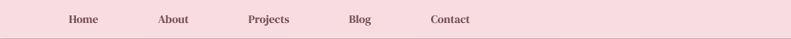
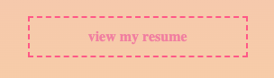
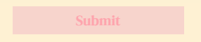
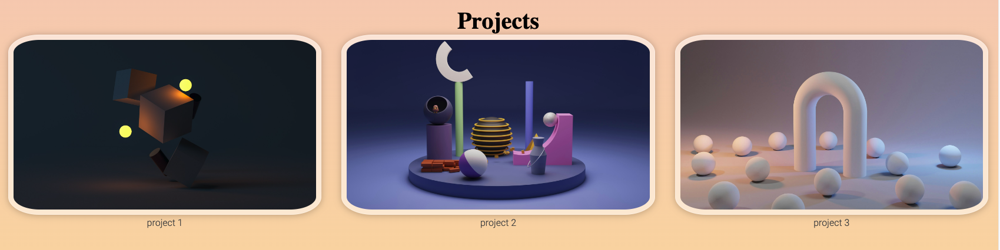
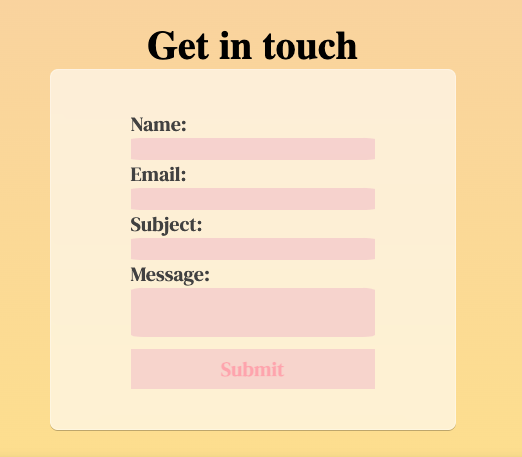
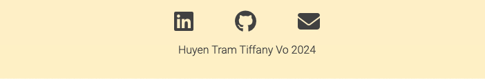
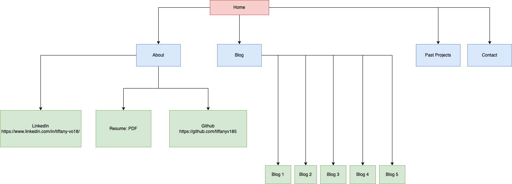

# T1A2-Portfolio

## Overview

### Purpose
The purpose of this online web portfolio is to showcase my skills and capabalities regarding web devlopement to potential future employers. 

### Functionality and features
Each page will have a sticky navigation bar on the top header. The navigation bar will have links to all pages of the website.
The pages include Home, About, Projects, Blog and Contacts.

Throughout the website, there will be <b> components </b> including:

* Sticky navigation bar (text component)

The sticky navigation bar serves the purpose of keeping the navigation menu fixed at the top of the viewport as the users scroll down the page. Benefits of having the naviation bar include accessability; it remains visable to users at all times, and potentially increased engagement as easy access to the navation bar encourages users to stay on the site longer and interact with other pages.
 
* Introduction (text and header component)

There is a large introduction with my name and photo on the site's landing page. This will hopefully establish and reinforce my personal brand and create a lasting and memorable first impression to users.
 
* Buttons (graphical component)

Buttons are included throughout the website. They allow enhanced user experience as they feel interactive and guide users to take specific actions, such as submitting a form and viewing my CV. They also allow users to differenciate the buttons from other elements quickly.
 
* Images (graphical component)

There are images placed throughout the website. The images have a zoom effect when users hover over them. This adds an interative element to the website, making it more engaging for users. The zoom effect also aid in drawing attention of users to important visuals and makes the site feel more responsive and intuitive.
 
* Contact Form (text component)

The contact forms appear at the bottom of the landing page and on the contacts page. Having a contact form facilitates direct communcation between users and the website owner. It also makes it convenient for users to message directly from the websit as opposed to opening their email client and composing an email.
 
* Footer (graphical component)

The footer will be located at the bottom of every page. It will contain icons that will link to LinkedIn, Github and my email address.
 

[Link to Github repo](https://github.com/tiffanyv185/T1A2-Portfolio.git)
### Sitemap

### Target Audience
The target audience for this site are potential employers who will be looking at hiring me for web development services.

### Tech Stack
* html
* css
* figma
* netlify
